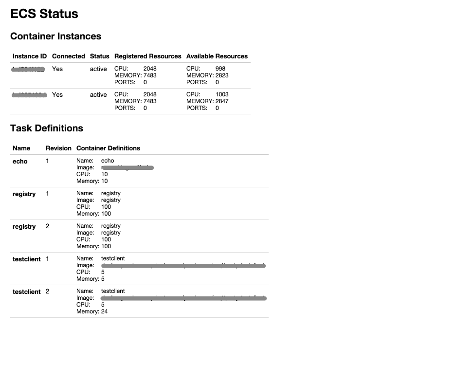

# ECS Status

**Note:** This code is mostly untested and is very much under construction.

We created this project because the AWS Console currently lacks [ECS](http://aws.amazon.com/ecs/) pages, and because using the CLI tools is painful if you want to have a quick overview of the status of your ECS cluster.

This project provides just that: an ECS cluster status one-pager. It currently looks like this:

## Installation

Clone this repository into your `$GOPATH` and copy the Makefile:

    cp Makefile.example Makefile

Then install the dependencies:

    make deps-restore

Build the binary:

    make build

And run it:

    ./bin/ecs-status

## Configuration

You can either copy `config.toml.example` to `config.toml`, and put your configuration strings there, or supply them with the environment variables `PORT`, `ACCESS_KEY_ID`, `SECRET_ACCESS_KEY`, and `CLUSTER_NAME`.

## Docker

To run this application in Docker, make sure to edit the Makefile to use the correct values for the environment variables that are listed there. Then build and run the Docker image:

    make run-docker
